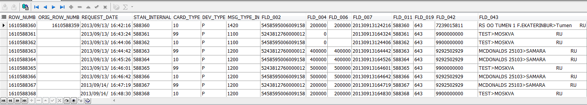

# 1. Database

### Using MESSAGES_LOG table example, please write ORACLE SQL select that will return all authorizations performed with card 5243812760000012 on 13.09.2013. at MCDONALDS. Local settings unknown. How many records will be returned? 

- SELECT * from MESSAGES_LOG  
  WHERE FLD_002 = 5243812760000012  
  AND DATE(REQUEST_DATE) = '2013-09-13'  
  AND FLD_043 like "MCDONALDS%"  